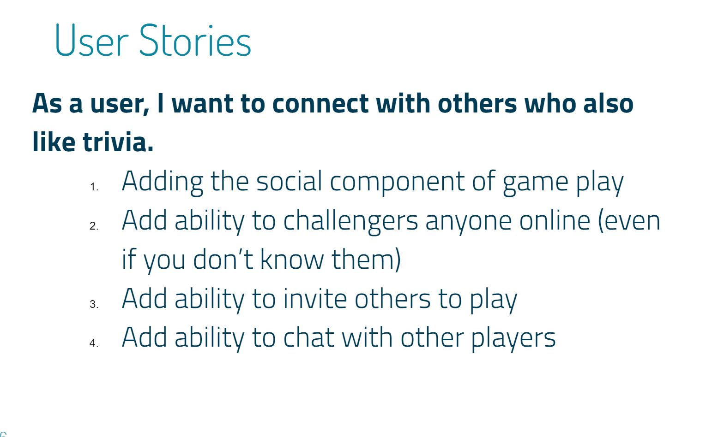
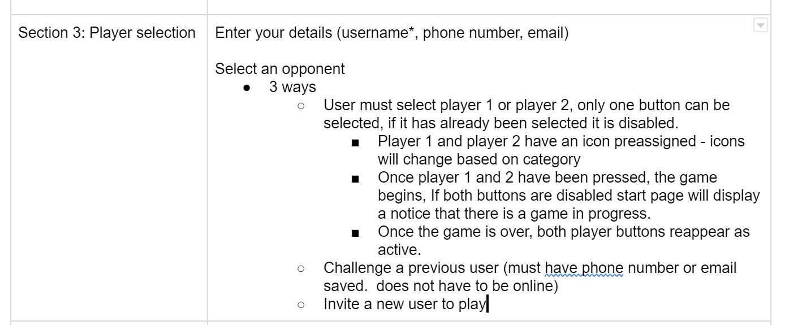
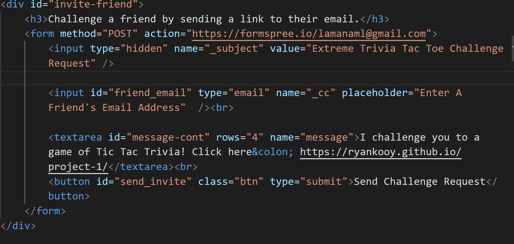
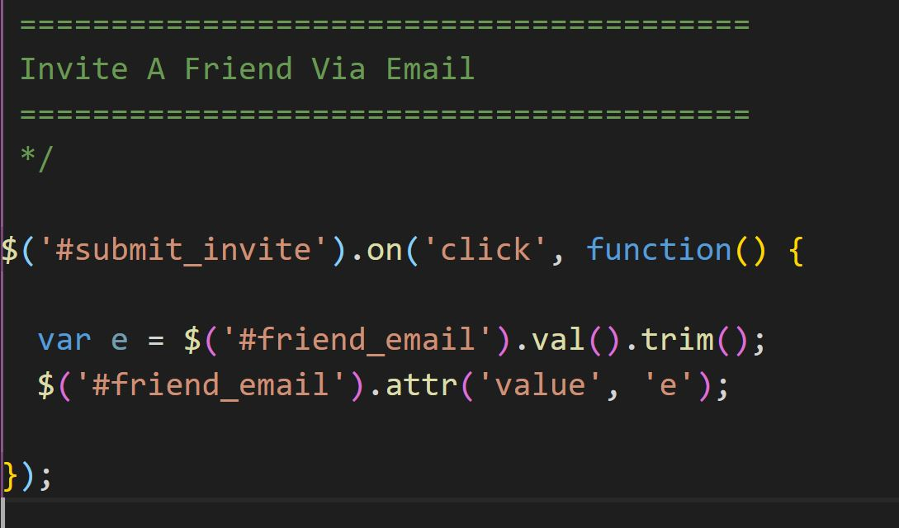
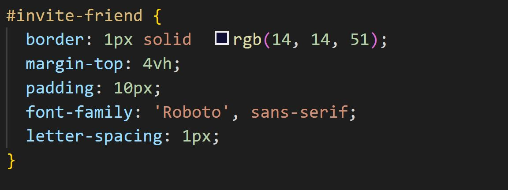

# UNC Coding Bootcamp Project 1 - Tic Tac Trivia!

## GitHub Deployment
 ### Live Site
 https://ryankooy.github.io/project-1/

 ### Repository
 https://github.com/ryankooy/project-1

## Introduction

This Tic Tac Trivia game can be used for both recreation and education. 

For recreation, it provides additional facets that will challenge the players in ways that standard trivia games do not.  The addition of the timer and the tic-tac-toe style 3-in-a-row challenge increases the level of competition and skill. In addition, the ability to select the difficulty level will provide a challenge to the novice as well as the seasoned trivia buff, and everyone in between.

For education, it provides a fun study alternative for students.  This Open Trivia API allows one to submit their own questions (this can be done by a teacher or student).  Once populated, students can challenge each other to a friendly competition style study session.  

## Design Process / Code Samples

This section is an example of our design process and will illustrate how we executed the initial requirements, from the design phase all the way through to implementation.

For the user story, we defined the need for the user to be able to connect with people 

This need was addressed in our conceptual design document

After reviewing several APIs to accomplish this, we selected FormSpree.  The HTML was created and the variables were defined and shared with other team members.

The back end team utilized the variables used in the javascript file, and JQuery was used to connect with the DOM 

The front end developers styled the variabes with custom CSS

Player submits the form!

Opponent get the invite via email!

After several iterations of trying to get the code to meet the precise requirements needed, and after several rounds of testing, the finished feature was successfully implemented. 

## Features and Functionality

- Used Open Trivia API and AJAX to import trivia questions with different categories and levels of difficulty.
 
- Used Firebase to provide real time communication between players, including a chat feature.
 
- Used Formspree API to implement the "Invite a Friend" functionality. Since this required inputting the email address, user input validation was used.
 
Using a combination of Bootstrap, Materialize, Animate, and Custom CSS, we were able to create a polished, mobile-responsive UI.
 
In addition to utilizing our existing knowledge, we pushed ourselves to incorporate new technologies into our design.  We investigated several solutions for our product (including React, Google Authentication API, translation APIs, and Spotify API), and through trial and error, went forward with Materalize and Animate. In addition, we dug deeper into the mobile-responsiveness requirement, and decided to use viewport measurements.
 
All code has been reviewed to ensure that it adheres to good quality coding standards, including layout, indentation, syntax and grammar.

## Usage
This game is intended for two players only. If additional players enter the site, they will be notified that the game is full.

 
## APIs used
Open Trivia API
FormSpree API

## Team Members
Ethan Donahue
LaMana Donadelle
Ryan Kooy
Jessie Sholler

## Supporting Documentation
 ###  Concept Development Document
https://docs.google.com/document/d/1x1-RtJWTrd8_3jiYtUmVJ-KKKoOl4DpSaesO2llv8iA/edit?usp=sharing

 ### Presentation
https://docs.google.com/presentation/d/15sv-fEeweKrSFRuVZl9AaOIQTjBqA8R54Xsnp2ABSmc/edit?usp=sharing

